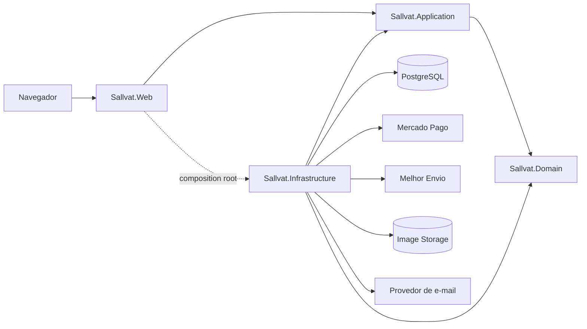
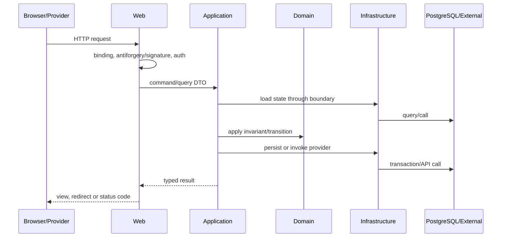

<!-- markdownlint-disable MD013 MD060 -->

# Arquitetura

## Visão geral

O Sallvat será um monólito modular ASP.NET Core MVC. Um único processo hospedará páginas públicas, área do cliente, área administrativa e endpoints de integração. Os módulos serão separados por responsabilidade dentro das camadas, preservando a opção de extração futura apenas se volume ou organização justificarem.

## Projetos da solution

| Projeto | Responsabilidade |
|---|---|
| `Sallvat.Domain` | Entidades, value objects, estados, invariantes e comportamento de domínio sem dependência de framework. |
| `Sallvat.Application` | Casos de uso, DTOs, validação de aplicação, autorização contextual e contratos para dependências externas. |
| `Sallvat.Infrastructure` | EF Core/Npgsql, Identity stores, implementações de pagamento, frete, storage, e-mail, relógio e observabilidade técnica. |
| `Sallvat.Web` | MVC, Razor Views, model binding, filtros, endpoints, Area Admin, middleware e composition root. |
| `Sallvat.UnitTests` | Testes rápidos de domínio e aplicação. |
| `Sallvat.IntegrationTests` | PostgreSQL real em container, pipeline HTTP e fronteiras de infraestrutura controladas. |

`Web` referencia `Infrastructure` somente para registrar implementações no composition root. Controllers não usam `DbContext` ou SDKs externos diretamente.

## Módulos funcionais

| Módulo | Responsabilidade | Não deve fazer |
|---|---|---|
| Catálogo | Produtos, variantes, atributos, imagens, publicação e consulta. | Confirmar estoque ou calcular pedido. |
| Clientes | Perfil comercial, endereços e associação a Identity. | Armazenar credenciais. |
| Carrinho | Itens pretendidos e mesclagem visitante/cliente. | Congelar preço ou reservar estoque. |
| Pedidos | Totais, snapshots, estados e orquestração do checkout. | Confiar em total enviado pelo navegador. |
| Pagamentos | Preferência, tentativas, webhook, conciliação e reembolso. | Armazenar dados de cartão. |
| Frete | Cotação, opção escolhida, etiqueta, serviço e rastreio. | Alterar pedido sem caso de uso autorizado. |
| Promoções | Validação e consumo de cupom. | Aplicar desconto fora do cálculo central. |
| Administração | Casos operacionais autorizados e auditados. | Contornar invariantes de domínio. |
| Identidade | Login, confirmação, recuperação, roles e cookies. | Substituir o perfil comercial `Customer`. |

## Dependências

### Permitidas

- `Application` depende de `Domain`;
- `Infrastructure` depende de `Application` e `Domain`;
- `Web` depende de `Application` e usa `Infrastructure` no bootstrap;
- módulos colaboram por casos de uso e tipos estáveis, não por acesso arbitrário a tabelas;
- testes dependem apenas das unidades sob teste e de infraestrutura de teste.

### Proibidas

- `Domain` depender de EF Core, MVC, Identity, Serilog ou SDK externo;
- controller acessar `DbContext`, `HttpClient` de provedor ou regra de preço diretamente;
- view executar consulta ou regra de negócio;
- `Application` referenciar `Web` ou implementação concreta de `Infrastructure`;
- criar repositório genérico, service locator, event bus distribuído ou CQRS framework;
- compartilhar modelos HTTP com payloads de provedores externos.

## Contratos de fronteira

Os nomes finais podem ser refinados sem alterar a responsabilidade:

- `IApplicationDbContext`: operações transacionais mínimas necessárias aos casos de uso; o `DbContext` continua sendo unit of work, sem outro wrapper genérico;
- `IPaymentGateway`: criar preferência, consultar pagamento e solicitar reembolso;
- `IFreightService`: cotar, criar envio/etiqueta e consultar rastreamento;
- `IImageStorage`: gravar, abrir e excluir objetos identificados por chave;
- `IEmailSender`: enviar mensagens transacionais tipadas;
- `IClock`: fornecer tempo UTC testável.

DTOs de integração serão específicos do provedor dentro de `Infrastructure`; `Application` receberá resultados internos pequenos e estáveis.

## Fluxo de requisição

## Transações e consistência

- uma transação PostgreSQL cobre criação do pedido, snapshots, cupom e reserva de estoque;
- chamadas HTTP externas não permanecem dentro de transação aberta;
- registros locais guardam chave idempotente e estado antes de chamadas repetíveis;
- webhook consulta o provedor e aplica alterações locais em nova transação;
- efeitos que falham após confirmação, como e-mail, podem ser reenviados sem reverter pagamento;
- conflitos de estoque ou estado retornam resultado explícito e não são sobrescritos automaticamente.

## Rotas e superfícies

- páginas públicas e de conta usam MVC/Razor;
- `/Admin/*` usa ASP.NET Core Area e role `Admin`;
- `/webhooks/mercado-pago` recebe apenas POST HTTPS e tem política de segurança própria;
- `/health/live` verifica processo e `/health/ready` verifica dependências essenciais, com exposição limitada pelo Nginx;
- não haverá API pública no MVP.

## Tratamento de erros

- exceções de validação e conflito são convertidas em mensagens seguras e códigos adequados;
- exceções inesperadas recebem correlation ID e página genérica;
- timeouts externos têm política curta de retry apenas quando a operação é idempotente;
- `ProblemDetails` pode ser usado nos endpoints técnicos; páginas MVC usam view de erro;
- stack trace aparece apenas em Development.

## Integrações externas

Mercado Pago, Melhor Envio, storage e e-mail são adaptadores de `Infrastructure`. URLs, tokens, timeouts e ambientes vêm de options validadas no startup. A indisponibilidade de um provedor deve degradar apenas o fluxo dependente e produzir log correlacionado, nunca credencial ou payload sensível.

## Evolução

Novos módulos permanecem no monólito enquanto compartilham deploy, banco e operação. Extração para outro processo só será considerada com evidência de gargalo, necessidade independente de escala ou ownership distinto. Decisões vigentes estão em [DECISIONS.md](DECISIONS.md).
