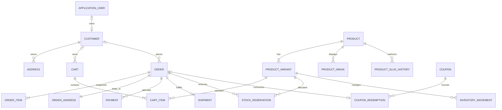

<!-- markdownlint-disable MD013 MD060 -->

# Banco de dados

## Convenções

- PostgreSQL com Entity Framework Core e Npgsql;
- `bigint generated by default as identity` para entidades comerciais e `uuid` para Identity, tokens e chaves idempotentes;
- nomes físicos em `snake_case` e nomes C# em PascalCase;
- `timestamptz` em UTC para instantes; `date` apenas para datas civis reais;
- dinheiro em `numeric(18,2)` e moeda ISO em `char(3)`, inicialmente `BRL`;
- peso em quilogramas `numeric(10,3)` e dimensões em centímetros `numeric(10,2)`;
- strings têm tamanho máximo explícito; textos longos usam `text`;
- FKs obrigatórias usam `Restrict` quando cascade poderia apagar histórico.

## Entidades

| Entidade | Propósito e campos essenciais |
|---|---|
| `ApplicationUser` | Identity com `Guid`, e-mail confirmado, lockout e credenciais. |
| `Customer` | Nome, e-mail normalizado, telefone e `ApplicationUserId` opcional/único. Existe também para guest. |
| `Address` | Endereço reutilizável do cliente; nunca substitui snapshot do pedido. |
| `Product` | Nome, slug, descrições, família e pirâmide olfativa, concentração, projeção, fixação, ocasiões, estação, período e status. |
| `ProductSlugHistory` | Slug antigo único e produto atual, para redirect 301 após mudança editorial. |
| `ProductVariant` | Volume, SKU, preço, moeda, peso, dimensões, `OnHand`, `Reserved`, ativo e versão de concorrência. |
| `ProductImage` | Chave no storage, texto alternativo, dimensões, posição e flag de capa. |
| `Cart` | Token público aleatório com hash/identificador seguro, cliente opcional, expiração e atualização. |
| `CartItem` | Variante, quantidade e data de inclusão; preço é sempre recalculado. |
| `Order` | Número público, cliente opcional, contato snapshot, status, subtotais, desconto, frete, total, moeda e timestamps. |
| `OrderAddress` | Snapshot imutável do endereço de entrega do pedido. |
| `OrderItem` | Snapshot de produto, variante, SKU, quantidade, preço unitário, desconto rateado e subtotal. |
| `StockReservation` | Pedido, variante, quantidade, expiração e estado da reserva. |
| `InventoryMovement` | Variante, tipo, quantidade assinada, saldo resultante, origem, ator e motivo. |
| `Payment` | Tentativa/preferência, provedor, IDs externos, status, valor, idempotency key e timestamps. |
| `Shipment` | Cotação escolhida, transportadora, serviço, valor/prazo snapshots, IDs externos, etiqueta e rastreio. |
| `Coupon` | Código normalizado, tipo/valor, janela, limites, mínimo, ativo e versionamento. |
| `CouponRedemption` | Cupom, pedido, cliente/e-mail, valor aplicado e instante. |
| `WebhookEvent` | Provedor, ID externo, tipo, hash/payload sanitizado, recebimento, processamento e resultado. |
| `AuditLog` | Ator, ação, entidade, chave, antes/depois sanitizados, IP, correlation ID e instante. |

`ProductCategory` não integra o MVP. Família olfativa e demais atributos atendem a descoberta inicial; uma taxonomia administrável só será adicionada com requisito de navegação ou merchandising.

## Relacionamentos



## Campos e snapshots importantes

### ProductVariant

- `Sku` único, comparado sem diferença de caixa;
- `VolumeMl` inteiro positivo;
- `Price >= 0`, `OnHand >= 0`, `Reserved >= 0` e `Reserved <= OnHand`;
- peso e dimensões estritamente positivos antes de permitir publicação;
- `ConcurrencyVersion` é um `Guid` gerenciado pela aplicação, atualizado a cada alteração comercial ou de estoque e configurado como token de concorrência otimista.

### Order

O total obedece a:

```text
ItemsSubtotal - DiscountTotal + ShippingTotal = GrandTotal
```

Todos os termos são não negativos, exceto que descontos são representados como valor positivo subtraído. O pedido guarda moeda, e-mail, nome e telefone usados na compra. `OrderNumber` é único e legível, gerado no servidor a partir de sequência; a chave interna não deve ser usada como autorização.

### OrderItem

Guarda `ProductName`, `VariantName`, `Sku`, `Quantity`, `UnitPrice`, `DiscountAmount` e `Subtotal`. O subtotal deve satisfazer `UnitPrice * Quantity - DiscountAmount` e nunca é recalculado a partir do catálogo após a criação.

## Índices e constraints

- `product.slug` unique em todos os estados, com comparação normalizada;
- `product_slug_history.slug` unique e diferente do slug atual do mesmo produto;
- `product_variant.sku` unique;
- `application_user.normalized_email` e `customer.application_user_id` unique conforme regras do Identity;
- índices em produto/status, pedido/número, pedido/status/criação, pedido/cliente, pagamento/ID externo e shipment/tracking code;
- `coupon.normalized_code` unique;
- `webhook_event(provider, external_event_id)` unique para deduplicação;
- `payment(provider, idempotency_key)` unique;
- no máximo uma imagem de capa por produto por índice parcial;
- no máximo uma reserva ativa por pedido/variante por índice parcial;
- FKs e checks impedem quantidades zero/negativas, totais inconsistentes e estados nulos.

## Estoque e concorrência

Disponível é calculado como `OnHand - Reserved`, nunca persistido separadamente.

### Reservar

1. iniciar transação curta;
2. recalcular pedido e ordenar variantes por ID para evitar deadlocks;
3. executar update condicional por variante onde `OnHand - Reserved >= quantidade`;
4. incrementar `Reserved`, criar `StockReservation` e confirmar somente se todas as linhas forem afetadas;
5. em falha, rollback completo e informar indisponibilidade.

### Confirmar venda

Após pagamento confirmado, decrementar `OnHand` e `Reserved` pela quantidade reservada, encerrar a reserva e inserir `InventoryMovement` do tipo `Sale` na mesma transação.

### Liberar

Cancelamento ou expiração decrementa apenas `Reserved`, marca a reserva como liberada e registra motivo. A operação usa estado anterior como condição para ser idempotente.

### Ajuste administrativo

Ajustes alteram `OnHand` por diferença e sempre criam movimento com ator e justificativa. Não podem reduzir `OnHand` abaixo de `Reserved`. Conflitos de versão retornam mensagem para recarregar, sem last-write-wins.

## Soft delete e retenção

- produto, variante, cupom e endereço usam inativação/arquivamento quando há histórico;
- pedidos, pagamentos, webhooks, movimentos e auditoria não têm exclusão operacional comum;
- carrinhos expirados podem ser eliminados por job conforme retenção técnica;
- cliente pode ser anonimizado conforme [LGPD.md](LGPD.md), preservando registros que precisem existir por obrigação legal;
- arquivos de imagem sem referência seguem limpeza controlada e auditável, nunca cascade cego.

## Migrations

Migrations ficarão em `Sallvat.Infrastructure`, serão revisadas e aplicadas explicitamente no deploy. Startup não executa migration. Mudanças destrutivas usam estratégia expand-and-contract, backup prévio e verificação de compatibilidade com rollback descrita em [DEPLOYMENT.md](DEPLOYMENT.md).
