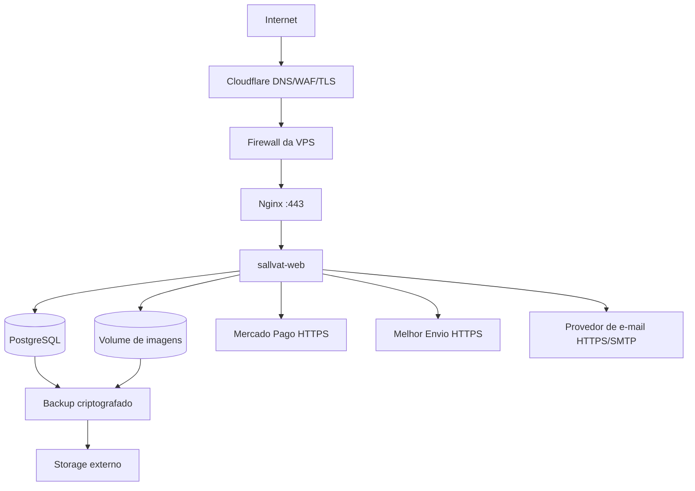

<!-- markdownlint-disable MD013 MD060 -->

# Infraestrutura

## Topologia de produção

## Componentes

| Componente | Responsabilidade | Exposição |
|---|---|---|
| `nginx` | TLS de origem, reverse proxy, headers, limites e assets. | 80/443; 80 apenas redireciona/desafio. |
| `sallvat-web` | ASP.NET Core MVC e jobs leves do monólito. | Rede Docker interna. |
| `postgres` | Dados relacionais. | Rede Docker interna; sem publicação da 5432. |
| volume de imagens | Objetos processados e chaves de Data Protection quando separado. | Montado apenas onde necessário. |
| backup job | `pg_dump`, cópia de imagens, criptografia e envio externo. | Sem porta pública. |

O backup pode começar como job controlado no host, desde que use credenciais mínimas, lock, logs e política de retenção. Não será criado outro serviço distribuído para isso.

## Redes e portas

- rede `edge`: Nginx e aplicações web;
- rede privada por ambiente: aplicação e PostgreSQL;
- Production e Staging não compartilham banco, volume, secret, cookie ou Data Protection key ring;
- firewall permite SSH apenas de origem administrativa quando possível e HTTP/HTTPS conforme estratégia Cloudflare;
- painel de banco, Docker socket e health detalhado não são publicados.

## Ambientes

### Development

- Windows/local com .NET 10 e Docker para PostgreSQL;
- imagem `postgres:18.6-alpine3.24`, com volume montado em `/var/lib/postgresql` conforme a convenção da imagem 18+;
- porta 5432 publicada apenas em `127.0.0.1` e senha fornecida por `.env` não versionado;
- user-secrets/variáveis locais;
- Mercado Pago e Melhor Envio em sandbox;
- dados descartáveis e e-mail capturado por ferramenta local;
- stack trace e logs detalhados apenas aqui.

### Staging

- mesmo VPS, stack Compose, rede, banco, volumes e credenciais isolados;
- subdomínio próprio protegido por Cloudflare Access;
- `noindex`, sitemap não público e dados sintéticos;
- integrações sandbox e chaves de webhook específicas;
- recursos limitados para não prejudicar Production.

### Production

- domínio oficial, credenciais produtivas e logs restritos;
- dados reais, backup externo e monitoramento;
- nenhum modo de teste, seed demonstrativo ou erro detalhado;
- alterações chegam somente após homologação em Staging.

## Configuração

`appsettings.json` contém apenas defaults não secretos. Arquivos por ambiente podem ajustar logging e flags não sensíveis. Connection strings, tokens, webhook secrets, SMTP/API keys e senha do banco são fornecidos fora da imagem.

Options são validadas no startup. A aplicação falha de forma segura quando configuração essencial está ausente, sem imprimir o valor. Nomes de cookie, application name do Data Protection e URLs externas são específicos por ambiente.

## Cloudflare e Nginx

- SSL/TLS `Full (strict)` e certificado válido na origem;
- proxy de IP/HTTPS configurado com allowlist de proxies conhecidos;
- redirecionamento canônico de host e HTTPS;
- limites de corpo distintos para páginas comuns e upload;
- timeout curto para requests normais e adequado para upload, sem mascarar timeout de provedor;
- headers de segurança definidos uma vez e verificados em resposta final;
- compressão e cache apenas para conteúdo seguro/versionado;
- firewall/WAF não substitui rate limiting da aplicação.

## PostgreSQL

- versão principal suportada e imagem fixada por patch/digest durante release;
- volume persistente exclusivo por ambiente;
- usuário da aplicação sem privilégios de superuser;
- usuário de migration separado quando operacionalmente viável;
- conexões com pool limitado aos recursos da VPS;
- manutenção, vacuum e espaço em disco monitorados;
- acesso administrativo por túnel SSH ou `docker exec`, nunca porta pública.

## Volumes

- dados PostgreSQL;
- imagens processadas;
- chaves Data Protection;
- certificados/configuração Nginx quando montados;
- staging e production usam nomes e caminhos explicitamente distintos;
- logs preferem stdout com rotação do runtime, não volume crescente sem limite.

## Backups

- `pg_dump` consistente diário e backup do volume de imagens coordenado;
- manifesto associa dump, objetos, versão da aplicação e checksum;
- criptografia antes do envio para destino externo;
- retenção inicial: 7 diários, 4 semanais e 6 mensais (`PBD-014`);
- cópia externa à VPS é obrigatória para produção;
- sucesso é verificado por tamanho, checksum e upload;
- restore trimestral em ambiente isolado, com evidência de tempo e resultado;
- snapshot da VPS é complemento, não único backup.

## Capacidade e disponibilidade

O MVP começa com uma instância web e um PostgreSQL. Restart policies reiniciam falhas, health checks evitam promover container não pronto e recursos têm limites coerentes. CPU, RAM e disco finais dependem de `PBD-015`; antes do go-live, executar teste de carga e garantir folga para banco, build/deploy e backup.

Não há promessa de zero downtime. Deploys podem usar janela curta; migrations devem permanecer compatíveis com rollback da imagem conforme [DEPLOYMENT.md](DEPLOYMENT.md).
