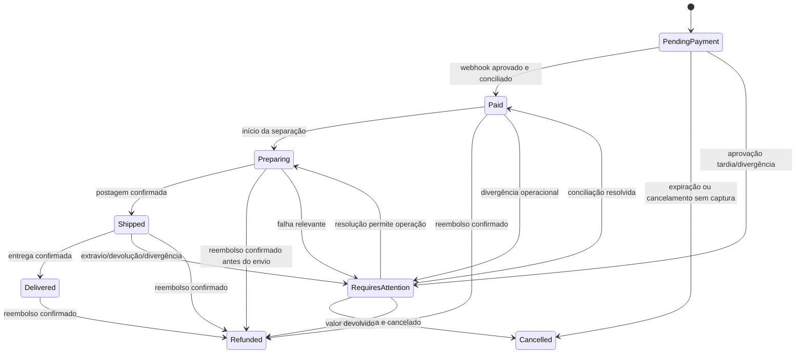

<!-- markdownlint-disable MD013 MD060 -->

# Pedidos

## Princípios

- pedido é o registro histórico da intenção comercial aceita pelo servidor;
- catálogo, cupom, frete e estoque são revalidados no momento da criação;
- itens, contato, endereço, opção de frete e totais são snapshots;
- pedido, pagamento e envio possuem estados independentes;
- toda transição valida estado de origem e é idempotente.

## Composição

`Order` contém número público, cliente opcional, e-mail/nome/telefone snapshots, totais, moeda, cupom aplicado, opção de frete e status. `OrderItem` contém nome do produto, variante, SKU, quantidade, preço unitário, desconto e subtotal. `OrderAddress` preserva o endereço usado no envio.

Nenhum total enviado pelo navegador é aceito. O cálculo central segue a fórmula registrada em [DATABASE.md](DATABASE.md#order).

## Estados

| Estado | Significado | Estoque | Pagamento | Envio |
|---|---|---|---|---|
| `PendingPayment` | Pedido criado, aguardando confirmação. | Reservado. | Preferência/tentativa pendente. | Não gerar envio. |
| `Paid` | Pagamento confirmado e valores conciliados. | Venda consumida. | Aprovado. | Pode preparar. |
| `Preparing` | Operação iniciou separação/embalagem. | Já consumido. | Aprovado. | Pode comprar/gerar etiqueta. |
| `Shipped` | Volume entregue à transportadora. | Sem alteração. | Aprovado. | Rastreio ativo. |
| `Delivered` | Entrega confirmada. | Sem alteração. | Aprovado. | Concluído. |
| `Cancelled` | Pedido não pago encerrado ou cancelado antes da captura. | Reserva liberada. | Sem valor capturado. | Não enviar. |
| `Refunded` | Valor capturado foi devolvido conforme política. | Não repor automaticamente. | Reembolso confirmado. | Pode exigir devolução. |
| `RequiresAttention` | Existe divergência que exige decisão operacional. | Estado preservado e explícito. | Pode estar aprovado ou divergente. | Bloqueado até revisão. |

## Máquina de estados

Transições para o mesmo estado retornam sucesso idempotente quando o mesmo evento já foi aplicado. Transições ausentes no diagrama são inválidas e geram conflito, não alteração forçada.

## Criação do pedido

1. identificar carrinho e comprador;
2. validar itens ativos, quantidades e dados de entrega;
3. consultar/revalidar frete escolhido;
4. recalcular preços e cupom;
5. iniciar transação;
6. reservar estoque de todas as variantes;
7. consumir logicamente o limite do cupom por `CouponRedemption` ligado ao pedido;
8. gravar pedido, snapshots e expiração;
9. confirmar transação;
10. criar preferência de pagamento fora da transação, com chave idempotente;
11. persistir resultado e redirecionar.

Falha ao criar a preferência mantém o pedido pendente e permite retry com a mesma chave. Se não for recuperado antes da expiração, um job libera a reserva e cancela o pedido.

## Transições inválidas relevantes

- `Cancelled → Paid`: aprovação tardia vai para `RequiresAttention`;
- `Refunded → Preparing/Shipped`: pedido reembolsado não volta à operação normal;
- `Delivered → Preparing/Shipped`: entrega é terminal para logística normal;
- `Paid/Preparing → Cancelled`: se houve captura, o fluxo correto é reembolso;
- qualquer redução manual de status sem caso de uso específico e justificativa auditada.

## Estoque

- criação em `PendingPayment` reserva;
- `Paid` consome `OnHand` e `Reserved` atomicamente;
- `Cancelled` libera reserva apenas uma vez;
- reembolso não repõe estoque automaticamente, porque devolução física pode não ter ocorrido;
- reposição por devolução é movimento administrativo separado e auditado;
- aprovação depois da reserva liberada tenta uma nova reserva apenas pelo caso de conciliação. Sem disponibilidade, permanece `RequiresAttention`.

## Cupom

Validação considera janela, status, mínimo, limite global, limite por cliente/e-mail e produtos elegíveis. O consumo é ligado ao pedido na transação de criação. Cancelamento sem pagamento libera o uso quando a regra permitir; reembolso não restaura automaticamente sem decisão operacional. Regras finais dependem de `PBD-009`.

## Operação administrativa

Cada comando exige estado de origem, versão de concorrência, ator e motivo quando sensível. Alteração de endereço após pagamento, override de frete, resolução de `RequiresAttention`, reembolso e mudança de status geram `AuditLog` com antes/depois sanitizados.

## Expiração e jobs

Um job periódico busca pedidos pendentes vencidos em lotes, usa update condicional e processa cada pedido de forma idempotente. Antes de cancelar, consulta pagamento quando houver preferência conhecida e risco de evento atrasado. Falhas são retentadas e observadas conforme [OBSERVABILITY.md](OBSERVABILITY.md).
