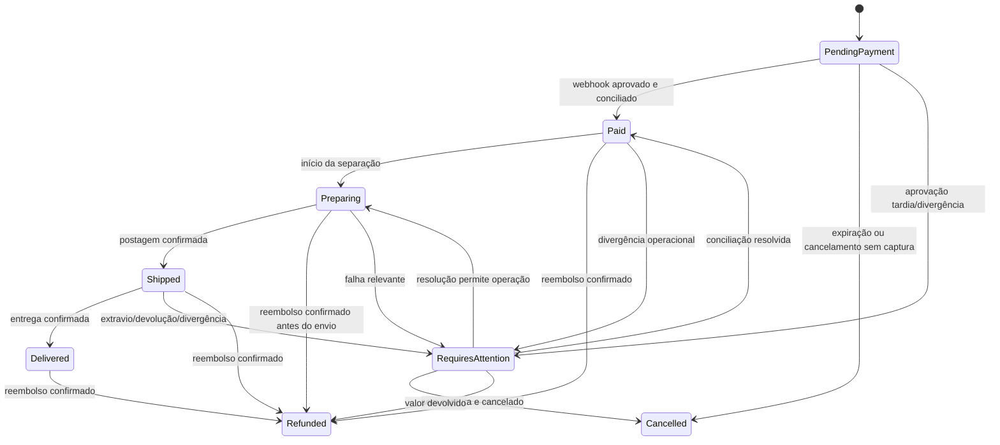

<!-- markdownlint-disable MD013 MD060 -->

# Pedidos

Estado conferido em 01/10/2026: criação/reservas/expiração, fila mínima e confirmação financeira Sandbox existem; fulfillment completo, acompanhamento guest por e-mail e resolução guiada ainda não. A máquina de estados do domínio não significa que toda transição já tenha uma ação administrativa disponível. Ver [STATUS.md](STATUS.md).

## Princípios

- pedido é o registro histórico da intenção comercial aceita pelo servidor;
- catálogo, cupom, frete e estoque são revalidados no momento da criação;
- itens, contato, endereço, opção de frete e totais são snapshots;
- pedido, pagamento e envio possuem estados independentes;
- toda transição valida estado de origem e é idempotente.

## Composição

`Order` contém número público, cliente opcional, e-mail/nome/telefone snapshots, totais, moeda, cupom aplicado, opção de frete e status. `OrderItem` contém nome do produto, variante, SKU, quantidade, preço unitário, desconto e subtotal. `OrderAddress` preserva o endereço usado no envio.

Antes da criação do pedido, `/checkout` monta um draft somente em memória. Nome, e-mail, telefone, CEP e endereço são normalizados no servidor; endereços salvos são pré-preenchimento editável para aquela compra e nunca são atualizados implicitamente. O ID de endereço enviado só é aceito quando pertence ao usuário autenticado. Guest informa os mesmos dados necessários sem criar credencial. CPF permanece ausente conforme `PBD-003`.

A revisão não grava pedido/reserva no banco; seu token protegido temporário contém o draft e exige o mesmo dono para confirmação. A ação pública de criação existe, mas fica bloqueada com `CheckoutEnabled=false` ou dependências inválidas. A revisão expira e frete/condições comerciais são revalidados antes da criação. Políticas oficiais e registro de suas versões ainda dependem de aprovação/implementação; a confirmação atual autoriza apenas o fluxo de teste, não representa aceite legal de políticas finais.

Nenhum total enviado pelo navegador é aceito. O cálculo central segue a fórmula registrada em [DATABASE.md](DATABASE.md#order).

## Estados

| Estado | Significado | Estoque | Pagamento | Envio |
|---|---|---|---|---|
| `PendingPayment` | Pedido criado, aguardando confirmação. | Reservado. | Preferência/tentativa pendente. | Não gerar envio. |
| `Paid` | Pagamento confirmado e valores conciliados. | Venda consumida. | Aprovado. | Pode preparar. |
| `Preparing` | Operação iniciou separação/embalagem. | Já consumido. | Aprovado. | Pode comprar/gerar etiqueta. |
| `Shipped` | Volume entregue à transportadora. | Sem alteração. | Aprovado. | Rastreio ativo. |
| `Delivered` | Entrega confirmada. | Sem alteração. | Aprovado. | Concluído. |
| `Cancelled` | Pedido não pago encerrado ou cancelado antes da captura. | Reserva liberada. | Sem valor capturado. | Não enviar. |
| `Refunded` | Valor capturado foi devolvido conforme política. | Não repor automaticamente. | Reembolso confirmado. | Pode exigir devolução. |
| `RequiresAttention` | Existe divergência que exige decisão operacional. | Estado preservado e explícito. | Pode estar aprovado ou divergente. | Bloqueado até revisão. |

## Máquina de estados

```mermaid
stateDiagram-v2
    [*] --> PendingPayment
    PendingPayment --> Paid: webhook aprovado e conciliado
    PendingPayment --> Cancelled: expiração ou cancelamento sem captura
    PendingPayment --> RequiresAttention: aprovação tardia/divergência
    Paid --> Preparing: início da separação
    Paid --> Refunded: reembolso confirmado
    Paid --> RequiresAttention: divergência operacional
    Preparing --> Shipped: postagem confirmada
    Preparing --> Refunded: reembolso confirmado antes do envio
    Preparing --> RequiresAttention: falha relevante
    Shipped --> Delivered: entrega confirmada
    Shipped --> RequiresAttention: extravio/devolução/divergência
    Shipped --> Refunded: reembolso confirmado
    Delivered --> Refunded: reembolso confirmado
    RequiresAttention --> Paid: conciliação resolvida
    RequiresAttention --> Preparing: resolução permite operação
    RequiresAttention --> Cancelled: sem captura e cancelado
    RequiresAttention --> Refunded: valor devolvido
```

Transições para o mesmo estado retornam sucesso idempotente quando o mesmo evento já foi aplicado. Transições ausentes no diagrama são inválidas e geram conflito, não alteração forçada.

A máquina está implementada no domínio e atualiza um token de concorrência a cada mudança. `RequiresAttention` exige motivo e instante UTC; os dois campos são protegidos por constraint e são limpos quando a ocorrência é resolvida. Nesta etapa, a operação manual expõe apenas `PendingPayment/RequiresAttention → RequiresAttention/Cancelled`; as demais arestas serão acionadas pelos casos de uso de pagamento, separação, envio e reembolso nas fases correspondentes.

## Criação do pedido

1. identificar carrinho e comprador;
2. validar itens ativos, quantidades e dados de entrega;
3. exigir um snapshot de frete positivo, vigente e completo; na Fase 6, consultar/revalidar a cotação escolhida antes do comando;
4. recalcular preços e cupom;
5. iniciar transação;
6. reservar estoque de todas as variantes;
7. consumir logicamente o limite do cupom por `CouponRedemption` ligado ao pedido;
8. gravar pedido, snapshots e expiração;
9. confirmar transação;
10. após confirmação separada, preparar/enviar Orders de teste fora da transação de criação, com chave idempotente e posse durável;
11. persistir resultado e redirecionar.

Falha de envio externo não autoriza retry de POST, troca de chave ou nova cobrança. Após posse durável, recuperar por consulta com ID conhecido ou encaminhar para revisão. O job de expiração aplica guardas locais, não consulta o gateway nem comprova ausência de pagamento externo; uma aprovação tardia exige revisão.

O comando usa `CheckoutAttemptId` e o carrinho de origem como identidade da tentativa. Repetir a mesma tentativa retorna o pedido existente sem duplicar estoque, cupom ou itens. O número público vem da sequence `order_number_sequence` e segue `SVT-aaaammdd-########`; a expiração inicial é configurável e começa em 30 minutos enquanto `PBD-005` não for decidida. O carrinho só é esvaziado depois que pedido, snapshots, resgates e reservas foram gravados com sucesso.

## Transições inválidas relevantes

- `Cancelled → Paid`: proibida; aprovação tardia coloca o pagamento em `RequiresAttention` e preserva pedido cancelado quando o domínio não permite transição;
- `Refunded → Preparing/Shipped`: pedido reembolsado não volta à operação normal;
- `Delivered → Preparing/Shipped`: entrega é terminal para logística normal;
- `Paid/Preparing → Cancelled`: se houve captura, o fluxo correto é reembolso;
- qualquer redução manual de status sem caso de uso específico e justificativa auditada.

## Estoque

- criação em `PendingPayment` reserva;
- `Paid` consome `OnHand` e `Reserved` atomicamente;
- `Cancelled` libera reserva apenas uma vez;
- reembolso não repõe estoque automaticamente, porque devolução física pode não ter ocorrido;
- reposição por devolução é movimento administrativo separado e auditado;
- aprovação depois da reserva liberada exige `RequiresAttention`; não há nova reserva automática. Resolução posterior precisa de caso de uso auditado ainda pendente.

## Cupom

Validação considera janela, status, mínimo, limite global, limite por cliente/e-mail e produtos elegíveis. O consumo é ligado ao pedido na transação de criação. Cancelamento sem pagamento libera o uso quando a regra permitir; reembolso não restaura automaticamente sem decisão operacional. Regras finais dependem de `PBD-009`.

## Operação administrativa

Cada comando exige estado de origem, versão de concorrência, ator e motivo quando sensível. Alteração de endereço após pagamento, override de frete, resolução de `RequiresAttention`, reembolso e mudança de status geram `AuditLog` com antes/depois sanitizados.

## Expiração e jobs

O serviço hospedado inicia após dois minutos e, a cada minuto, busca até 100 pedidos `PendingPayment` vencidos em ordem de expiração. Exclui pagamentos com `ExternalPaymentId` ou `RequiresAttention`, revalidando antes da mutação. Cada pedido elegível é processado isoladamente: reserva passa a `Released`, saldo reservado diminui, movimento `ReservationRelease` é gravado e consumo de cupom é liberado preservando histórico. Repetição não duplica efeitos. Não há HTTP nesse job; consulta financeira é responsabilidade da recuperação/webhook, e pagamento tardio não reabre pedido automaticamente.

## Implementação administrativa atual

`GET /Admin/Pedidos` lista até 100 pedidos aguardando pagamento ou revisão, com prioridade para ocorrências. Os comandos usam antiforgery e policy `Admin`, exigem token de concorrência e justificativa de 5 a 500 caracteres. Marcar revisão ou cancelar gera `AuditLog` com origem, destino, motivo, ator e correlation ID. Expiração automática não inventa usuário: seus movimentos possuem ator nulo e motivo técnico explícito.
