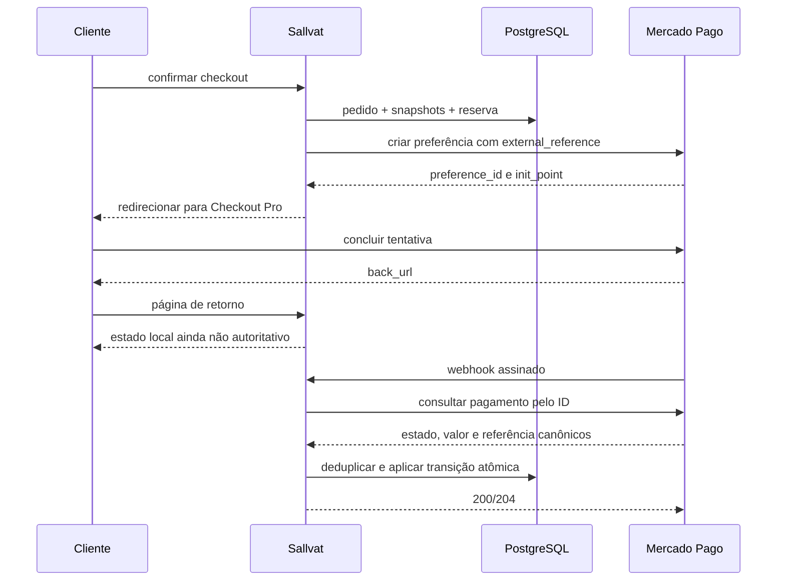

<!-- markdownlint-disable MD013 MD060 -->

# Pagamentos

## Implementação atual — fundação local

`Payment` e a migration `AddPaymentFoundation` implementam o registro local de uma tentativa, com snapshot do total/moeda/referência do pedido, ambiente explícito, chave idempotente, preferência opcional, expiração e token de concorrência. A criação exige pedido `PendingPayment` não expirado; a validade é herdada do pedido, sem estabelecer uma nova política comercial.

As operações disponíveis são `Created → Pending` ao registrar uma preferência e `Created/Pending → RequiresAttention` quando o resultado é incerto. Resposta de preferência recebida na expiração ou depois dela também exige revisão. Repetir o mesmo ID não altera versão nem timestamps; trocar uma preferência já registrada é recusado. Receber uma preferência depois de um resultado incerto preserva a revisão, sem reabrir a tentativa.

O banco tem unicidade por `(Provider, Environment, IdempotencyKey)` e por preferência não nula no mesmo provedor/ambiente. Um índice único parcial permite no máximo uma tentativa `Created`, `Pending`, `Approved` ou `RequiresAttention` por pedido, inclusive entre ambientes. Não basta gerar outra chave para repetir uma operação incerta. Motivos de revisão são códigos fechados, sem payload ou mensagem livre do provedor.

Esta entrega não contém orquestrador de checkout financeiro, credenciais, endpoints públicos de pagamento, redirecionamento pela loja, webhook ou reembolso. O adapter HTTP isolado descrito abaixo está disponível, mas desabilitado e sem consumidor na tela. `Approved`, `Rejected`, `Cancelled`, `Expired` e `Refunded` estão reservados no enum; não há método genérico que aplique esses estados. Nenhuma operação de `Payment` altera pedido, reserva ou estoque. IDs de pagamento/merchant order, timestamps canônicos, eventos e valores reembolsados serão acrescentados com a integração correspondente.

`IPaymentPreparationService` implementa a primeira metade do fluxo interno: autoriza o pedido, relê seu estado e reservas e persiste a tentativa sem chamar o provedor. A migration é aplicada somente em banco efêmero pelo teste relacional do CI; não foi aplicada à loja ou automaticamente no startup.

### Preparação persistida sem chamada externa

`PrepareAsync` recebe ID do pedido, identidade interna (`CartOwner`) e ambiente Sandbox. Não recebe preço, desconto, moeda, preferência ou chave idempotente do navegador. O chamador futuro deve construir a identidade a partir de sessão/claims, nunca aceitar um user ID arbitrário do formulário.

- conta autenticada: exige associação explícita `Order.CustomerId → Customer.ApplicationUserId`, sem associação por e-mail;
- guest: exige token válido da sacola de origem ainda não expirada, sem dono autenticado, e pedido não vinculado a uma conta; não implementa consulta histórica guest;
- pedido alheio e inexistente retornam `NotFound`, sem ID de pagamento ou dados pessoais;
- snapshots de itens, desconto e frete precisam fechar o total; reservas precisam corresponder às variantes/quantidades, continuar `Reserved` e ter a mesma validade do pedido;
- tentativa nova recebe UUID no servidor; pedido e pagamento são salvos juntos em transação serializável, com alteração do token de concorrência do pedido para disputar com cancelamento/expiração;
- tentativa em aberto é reutilizada com `AlreadyPrepared`; divergência de ambiente/snapshot, `RequiresAttention` ou captura já registrada impedem nova tentativa;
- unicidade, concorrência e serialização resultam em `Conflict`, sem HTTP ou retry automático;
- mudanças não salvas no contexto são preservadas e retornam `Conflict`, evitando sobrescrever outra unidade de trabalho.

O serviço não entrega URL ou chave idempotente ao cliente, não altera estoque/cupom/status do pedido e não chama o gateway. `Created` persistido e `AlreadyPrepared` não provam que uma operação externa nunca ocorreu; após eventual queda do processo, não reenviar automaticamente. Ainda faltam dispatcher com posse exclusiva do envio, revalidação antes do POST, persistência independente do cancelamento do navegador, consulta/conciliação e retorno não autoritativo. O semáforo InMemory serve somente aos testes locais; no PostgreSQL, transação, índices e versões fazem a proteção.

## Adapter de preferência — testes isolados

`IPaymentGateway.CreatePreferenceAsync` recebe um snapshot interno com chave, ambiente, referência, total BRL, frete, validade e itens líquidos após rateio do desconto. O futuro orquestrador deve obtê-lo do pedido persistido, nunca de valores postados pelo navegador. A soma exata de itens e frete é conferida antes do HTTP; valores negativos, precisão superior a centavos, itens inválidos ou validade vencida são recusados. O rateio de descontos por unidade e a montagem a partir de `OrderItem` ainda serão integrados ao orquestrador; não se deve dividir centavos de modo que a soma deixe de fechar.

`MercadoPagoPaymentGateway` usa `POST https://api.mercadopago.com/checkout/preferences`, sem SDK adicional, com itens, frete separado, referência, validade herdada e URLs HTTPS. Não envia CPF, dados de cartão, contato do comprador, política de parcelamento ou `notification_url` enquanto o webhook não existir. A forma do payload segue a [referência de criação de preferência](https://www.mercadopago.com.br/developers/pt/reference/online-payments/checkout-pro-preferences/create-preference/post). A chave estável é enviada em `X-Idempotency-Key`, também usado no [exemplo oficial do SDK PHP](https://github.com/mercadopago/sdk-php/blob/master/examples/Preference/Create.php); isso não autoriza retry cego nem substitui a deduplicação local.

O cliente tem limite total de 2–30 segundos, incluindo leitura do corpo, e buffer máximo de 64 KiB. Não segue redirects HTTP nem registra corpos, tokens ou mensagens de exceção. A resposta só fornece uma URL quando ID, referência, vendedor esperado e validade passam na validação; aceita apenas HTTPS em `www.mercadopago.com.br`, caminho `/checkout/` e `pref_id` correspondente, sem usuário, fragmento ou porta alternativa. Isso valida o destino do redirect, não confirma pagamento.

Resultados internos são `Created`, `Disabled`, `InvalidRequest`, `ConfigurationInvalid`, `AuthenticationFailure`, `Rejected` e `OutcomeUnknown`. `Created` significa somente preferência recebida, nunca pedido pago. HTTP 400/422 recusa o pedido ao provedor; 401/403 sinaliza autenticação; timeout, falha de transporte, 408/409/429/5xx, resposta inválida ou inesperada e cancelamento após iniciar envio resultam em `OutcomeUnknown`. Cancelamento antes do envio propaga cancelamento sem HTTP. Não há retry automático ou liberação de reserva por esses resultados.

O futuro orquestrador deve persistir `Created` antes do POST e gravar `RequiresAttention` em resultado incerto, inclusive quando o navegador cancelar, usando um prazo interno independente. Se o processo cair após o POST, a tentativa persistida deve impedir novo POST até conciliação. Persistência/transações e consulta posterior ainda não fazem parte do adapter; chamar o método duas vezes não é deduplicado por ele.

### Configuração e limites de homologação

`Payments:MercadoPago` é versionado com `Enabled=false`, `Environment=Sandbox`, token/origem vazios, `TestSellerId=0`, `TestSellerConfirmed=false` e timeout de 10 segundos. Production é recusado nesta etapa. Nenhum segredo foi configurado e os testes usam somente HTTP fake.

Para futura homologação, conferir no painel o vendedor de teste e fornecer por secrets/variáveis `Payments__MercadoPago__AccessToken`, `PublicOrigin`, `TestSellerId` e `TestSellerConfirmed` sob o mesmo prefixo. A confirmação é operacional, não detecção automática da natureza da conta. O `collector_id` deve coincidir com o ID configurado. Não usar o token da conta comercial: [credenciais Checkout Pro de teste também podem começar por `APP_USR`](https://www.mercadopago.com.br/developers/pt/docs/checkout-pro-preferences/test-accounts). Os testes com usuário de teste seguem o `init_point`, conforme [orientação oficial](https://www.mercadopago.com.br/developers/pt/news/2023/11/16/Questions-on-how-to-test-your-integration--); `sandbox_init_point` não é usado como prova de ambiente.

Não habilitar o fluxo completo ainda: os caminhos planejados `/pagamentos/retorno/sucesso`, `/pagamentos/retorno/pendente` e `/pagamentos/retorno/falha` são montados a partir de `PublicOrigin`, mas suas páginas ainda não existem. Faltam envio persistido, retorno não autoritativo, webhook, conciliação e homologação ponta a ponta. Este avanço não altera a loja estática no Pages, não cria migration e não conclui `F7-S1`.

## Estratégia de Checkout Pro

### Adapter Orders — incremento isolado de 22/09/2026

`IPaymentGateway.CreateOrderAsync` usa `PaymentOrderRequest` e `PaymentOrderResult`, sem confundir `ExternalOrderId` com `PreferenceId`. O POST vai apenas para `/v1/orders`. Valores usam strings decimais invariantes, e o total deve fechar exatamente a soma das linhas. A validade enviada é uma duração ISO 8601 arredondada para baixo; o limite local desta etapa é de 1 segundo a 24 horas. O vencimento local continua autoritativo para liberar reservas e exigir revisão de aprovação tardia.

O futuro montador deve partir dos snapshots, ratear descontos em centavos (dividindo uma linha em dois preços quando necessário) e incluir frete como linha explícita uma única vez. O adapter valida a soma, mas não monta ou persiste snapshots. Não são enviados CPF, e-mail, endereço, parcelas, juros ou restrições de meios de pagamento; essas decisões não foram presumidas. O campo `client_token` da resposta é descartado.

`Payments:MercadoPago:OrdersEnabled` é independente de `Enabled` (Preferences), ambos `false` por padrão. Habilitar os dois é configuração inválida. Só Sandbox é aceito, com vendedor de teste confirmado e origem HTTPS; isso não detecta automaticamente se uma credencial pertence a conta de teste. Uma resposta 201 só produz `Created` após conferir vendedor, referência, moeda, país, total, ausência de valor pago, estado `created`, tipo/mode e URL HTTPS brasileira com o mesmo `order_id`. `Created` significa recurso externo criado, nunca pedido pago.

Timeout, cancelamento após envio, HTTP 409/423/429/5xx, JSON inválido, resposta maior que 64 KiB ou divergência produzem `OutcomeUnknown`, sem retorno de URL/ID, retry ou fallback. Erros 400/422 são rejeições e 401/403 falhas de autenticação; nenhum corpo do provedor é exposto. O cliente registrado mantém redirects HTTP desativados e não registra logs HTTP. Referências: [contrato Orders](https://www.mercadopago.com.br/developers/pt/reference/online-payments/checkout-pro/create-order/post) e [guia de criação](https://www.mercadopago.com.br/developers/pt/docs/checkout-pro-orders/create-order).

**Limites:** somente testes HTTP simulados, sem credenciais ou chamadas reais. Nenhuma migration, endpoint público, página de retorno ou alteração visual. O banco ainda não armazena ID Orders. Posse exclusiva do envio, persistência do resultado independente do navegador, recuperação de queda, consulta e webhook continuam pendentes. Não habilitar esta flag na loja; homologar esses fluxos primeiro.

### Decisão registrada

Revisão em 21/09/2026: o provedor recomenda [Checkout Pro via Orders para novas integrações](https://www.mercadopago.com.br/developers/pt/reference/online-payments/checkout-pro-orders/overview) e mantém suporte à API de Preferências. Este incremento preserva o plano aprovado de preferências; a adoção de Orders deve ser avaliada antes de homologar o checkout completo, pois altera payload, IDs, retorno e notificações. Nenhuma migração automática de contrato foi presumida.

A revisão foi registrada no [ADR-015](DECISIONS.md#adr-015--preparação-local-independente-da-api-de-checkout): preparar a tentativa local de forma independente e validar Orders no próximo incremento externo. Orders usa total monetário em string, duração de validade, `checkout_url` e identificador próprio; o frete/desconto precisa fechar a soma dos itens e as notificações/consultas precisam seguir o recurso correto. Não haverá fallback automático entre as APIs, pois poderia abrir duas intenções externas para o mesmo pedido.

O MVP usa Mercado Pago Checkout Pro por redirecionamento. O Sallvat não coleta, transmite nem armazena número completo de cartão ou CVV. O gateway é uma fronteira de infraestrutura; estados do domínio não dependem diretamente dos nomes do provedor.

Referência de implementação: [notificações do Checkout Pro](https://www.mercadopago.com.br/developers/pt/docs/checkout-pro/payment-notifications).

## Modelo local

Um pedido pode ter mais de um `Payment`, representando tentativas. Campos essenciais:

- provedor e ambiente;
- ID da preferência, pagamento e merchant order quando aplicável;
- `ExternalReference` apontando ao identificador estável do pedido;
- status interno `Created`, `Pending`, `Approved`, `Rejected`, `Cancelled`, `Expired`, `Refunded` ou `RequiresAttention`; `PartiallyRefunded` só será adicionado se `PBD-006` aprovar reembolso parcial;
- valor, moeda e valores reembolsados;
- chave idempotente da operação;
- timestamps do provedor e locais;
- código de erro/rejeição sanitizado.

Status de pagamento não substitui `OrderStatus`.

## Contrato interno

`IPaymentGateway` implementa a criação da preferência. Consulta canônica e reembolso abaixo são capacidades planejadas e serão acrescentadas com seus casos de uso:

- criar preferência a partir de pedido e URLs de retorno;
- consultar o estado canônico de um pagamento externo;
- solicitar reembolso total ou, se aprovado em `PBD-006`, parcial.

O contrato retorna IDs, estado normalizado, valor, moeda e timestamps. Payloads do Mercado Pago ficam em `Infrastructure`.

## Fluxo

## Criar preferência

- criar o pedido local antes da chamada externa;
- usar `OrderNumber`/ID opaco como `external_reference` e nunca dados pessoais;
- enviar itens e valor recalculados pelo servidor;
- configurar HTTPS nas URLs de sucesso, pendência e falha;
- alinhar expiração da preferência à reserva quando o meio de pagamento permitir;
- armazenar uma chave idempotente estável por operação e reutilizá-la em retry;
- timeouts não autorizam criar uma segunda preferência sem antes consultar ou repetir idempotentemente.

## URLs de retorno

Retornos servem apenas para experiência do cliente. A página mostra `aguardando confirmação`, `pagamento confirmado` ou `não aprovado` conforme estado local. Query strings do navegador nunca alteram pagamento ou pedido.

## Webhook

O endpoint recebe POST HTTPS e:

1. limita tamanho do corpo e captura correlation ID;
2. valida o formato mínimo e a assinatura `x-signature` com o segredo do ambiente;
3. calcula uma chave de deduplicação por provedor, evento e objeto;
4. registra `WebhookEvent` sem segredos ou dados excessivos;
5. consulta o pagamento na API usando credencial server-side;
6. valida ambiente, `external_reference`, valor e moeda contra o pedido;
7. aplica status de pagamento, estoque e pedido em uma transação;
8. marca o evento como processado;
9. responde rapidamente com sucesso para evento válido, inclusive duplicado.

Assinatura válida não elimina a consulta ao provedor. Evento inválido recebe resposta apropriada e log seguro. Falha transitória retorna erro que permita retry do provedor; falha permanente é registrada sem loop infinito.

## Idempotência e duplicatas

- unique constraint em `(Provider, ExternalEventId)` para eventos;
- unique constraint em `(Provider, Environment, IdempotencyKey)` para comandos externos;
- transição usa estado de origem e ID externo como condição;
- webhook repetido não consome estoque, cupom ou envia comunicação duas vezes;
- refund retry usa a mesma chave para a mesma intenção;
- uma nova intenção recebe nova chave.

## Mapeamento para pedido

- aprovado e conciliado: `PendingPayment → Paid` e consumo da reserva;
- pendente: pedido permanece `PendingPayment`;
- rejeitado: tentativa é marcada, mas pedido pode aceitar outra tentativa até expirar;
- cancelado/expirado sem captura: pedido pode ser cancelado e reserva liberada;
- aprovado após expiração, valor divergente ou referência desconhecida: `RequiresAttention`;
- reembolso confirmado: `Refunded`, sem reposição automática de estoque.

## Cancelamento e reembolso

Cancelar pedido sem captura é operação local e, se necessário, cancela a preferência. Com valor capturado, o administrador solicita reembolso; o pedido só vira `Refunded` após confirmação canônica. Falha mantém o estado anterior e expõe ação de retry segura. Reembolso parcial será implementado somente após `PBD-006`.

## Conciliação

Um job pode consultar pagamentos pendentes antigos ou eventos em falha. Ele usa paginação, limites e as mesmas transições idempotentes do webhook. Divergências geram alerta operacional e `RequiresAttention`; não são corrigidas por overwrite.

## Configuração e logs

Sandbox e produção usam aplicações, tokens, webhook secrets e URLs diferentes. Segredos vêm de variáveis/secret files e nunca de `appsettings` versionado. Logs podem conter IDs externos, status, duração e código de erro, mas não access token, assinatura, payload integral, documento ou dados de cartão.

## Decisões pendentes

`PBD-004`, `PBD-005` e `PBD-006` determinam meios, parcelas, expiração e política de reembolso.
