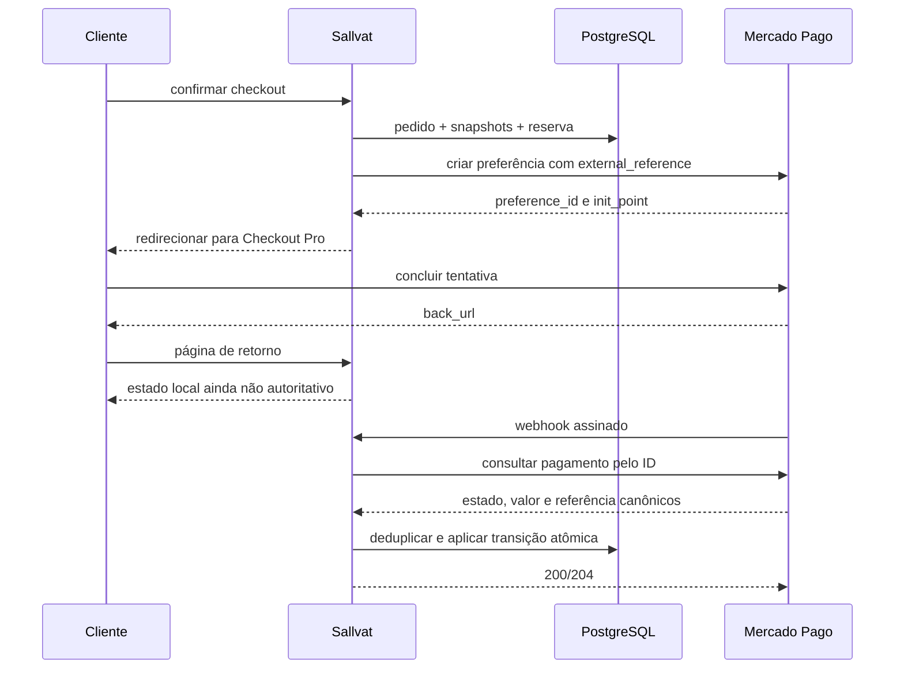

<!-- markdownlint-disable MD013 MD060 -->

# Pagamentos

## Estratégia

O MVP usa Mercado Pago Checkout Pro por redirecionamento. O Sallvat não coleta, transmite nem armazena número completo de cartão ou CVV. O gateway é uma fronteira de infraestrutura; estados do domínio não dependem diretamente dos nomes do provedor.

Referência de implementação: [notificações do Checkout Pro](https://www.mercadopago.com.br/developers/pt/docs/checkout-pro/payment-notifications).

## Modelo local

Um pedido pode ter mais de um `Payment`, representando tentativas. Campos essenciais:

- provedor e ambiente;
- ID da preferência, pagamento e merchant order quando aplicável;
- `ExternalReference` apontando ao identificador estável do pedido;
- status interno `Created`, `Pending`, `Approved`, `Rejected`, `Cancelled`, `Expired`, `Refunded` ou `RequiresAttention`; `PartiallyRefunded` só será adicionado se `PBD-006` aprovar reembolso parcial;
- valor, moeda e valores reembolsados;
- chave idempotente da operação;
- timestamps do provedor e locais;
- código de erro/rejeição sanitizado.

Status de pagamento não substitui `OrderStatus`.

## Contrato interno

`IPaymentGateway` expõe apenas capacidades necessárias:

- criar preferência a partir de pedido e URLs de retorno;
- consultar o estado canônico de um pagamento externo;
- solicitar reembolso total ou, se aprovado em `PBD-006`, parcial.

O contrato retorna IDs, estado normalizado, valor, moeda e timestamps. Payloads do Mercado Pago ficam em `Infrastructure`.

## Fluxo

## Criar preferência

- criar o pedido local antes da chamada externa;
- usar `OrderNumber`/ID opaco como `external_reference` e nunca dados pessoais;
- enviar itens e valor recalculados pelo servidor;
- configurar HTTPS nas URLs de sucesso, pendência e falha;
- alinhar expiração da preferência à reserva quando o meio de pagamento permitir;
- armazenar uma chave idempotente estável por operação e reutilizá-la em retry;
- timeouts não autorizam criar uma segunda preferência sem antes consultar ou repetir idempotentemente.

## URLs de retorno

Retornos servem apenas para experiência do cliente. A página mostra `aguardando confirmação`, `pagamento confirmado` ou `não aprovado` conforme estado local. Query strings do navegador nunca alteram pagamento ou pedido.

## Webhook

O endpoint recebe POST HTTPS e:

1. limita tamanho do corpo e captura correlation ID;
2. valida o formato mínimo e a assinatura `x-signature` com o segredo do ambiente;
3. calcula uma chave de deduplicação por provedor, evento e objeto;
4. registra `WebhookEvent` sem segredos ou dados excessivos;
5. consulta o pagamento na API usando credencial server-side;
6. valida ambiente, `external_reference`, valor e moeda contra o pedido;
7. aplica status de pagamento, estoque e pedido em uma transação;
8. marca o evento como processado;
9. responde rapidamente com sucesso para evento válido, inclusive duplicado.

Assinatura válida não elimina a consulta ao provedor. Evento inválido recebe resposta apropriada e log seguro. Falha transitória retorna erro que permita retry do provedor; falha permanente é registrada sem loop infinito.

## Idempotência e duplicatas

- unique constraint em `(Provider, ExternalEventId)` para eventos;
- unique constraint em `(Provider, IdempotencyKey)` para comandos externos;
- transição usa estado de origem e ID externo como condição;
- webhook repetido não consome estoque, cupom ou envia comunicação duas vezes;
- refund retry usa a mesma chave para a mesma intenção;
- uma nova intenção recebe nova chave.

## Mapeamento para pedido

- aprovado e conciliado: `PendingPayment → Paid` e consumo da reserva;
- pendente: pedido permanece `PendingPayment`;
- rejeitado: tentativa é marcada, mas pedido pode aceitar outra tentativa até expirar;
- cancelado/expirado sem captura: pedido pode ser cancelado e reserva liberada;
- aprovado após expiração, valor divergente ou referência desconhecida: `RequiresAttention`;
- reembolso confirmado: `Refunded`, sem reposição automática de estoque.

## Cancelamento e reembolso

Cancelar pedido sem captura é operação local e, se necessário, cancela a preferência. Com valor capturado, o administrador solicita reembolso; o pedido só vira `Refunded` após confirmação canônica. Falha mantém o estado anterior e expõe ação de retry segura. Reembolso parcial será implementado somente após `PBD-006`.

## Conciliação

Um job pode consultar pagamentos pendentes antigos ou eventos em falha. Ele usa paginação, limites e as mesmas transições idempotentes do webhook. Divergências geram alerta operacional e `RequiresAttention`; não são corrigidas por overwrite.

## Configuração e logs

Sandbox e produção usam aplicações, tokens, webhook secrets e URLs diferentes. Segredos vêm de variáveis/secret files e nunca de `appsettings` versionado. Logs podem conter IDs externos, status, duração e código de erro, mas não access token, assinatura, payload integral, documento ou dados de cartão.

## Decisões pendentes

`PBD-004`, `PBD-005` e `PBD-006` determinam meios, parcelas, expiração e política de reembolso.
